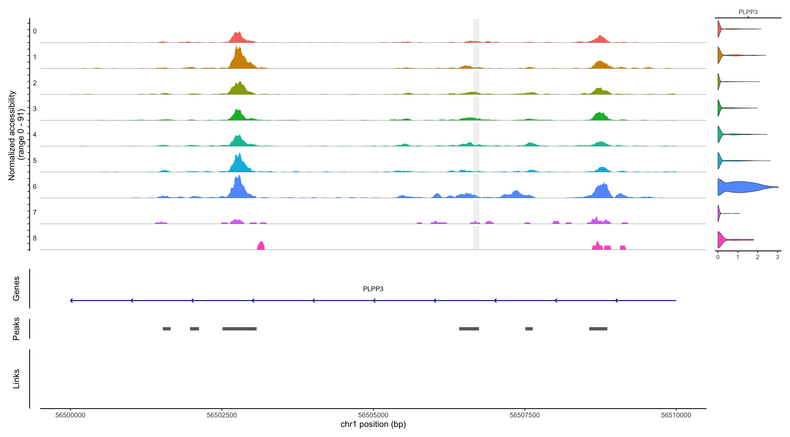

I am a student in the DPhil Clinical Medicine program at Oxford under the supervision of [Chris O'Callaghan](https://www.ndm.ox.ac.uk/team/chris-ocallaghan) and [Lucy Davison](https://www.rvc.ac.uk/about/our-people/lucy-davison). My research focuses on the molecular mechanisms of heritable astherosclerosis disease risk. Specifically, I use primary human cell models to study the transcriptional and epigenetic regulation at early stages of atherogenesis, integrate the resulting data with GWAS statistics to functionally annotate atherosclerotic SNPs, and hopefully identify novel mechanisms of susceptibility in atherosclerosis. 

 

Prior to my study at Oxford, I received my B.E. degree from Zhejiang University, China. My undergraduate thesis at the [Zhang lab](https://person.zju.edu.cn/en/yzhang) developed an ODE-based toxiocokinetic model of glycidyl-based chemicals (a common contaminant in processed food products). I have also worked in epidemiologic risk assessment, deep learning, and statistical modeling.

I was a member of [the Mixed Class (Honors Program of Engineering)](http://ckc.zju.edu.cn/ckcen/34928/list.htm) at Zhejiang University (2017-2020), an exchange student at UC Berkeley (2018), and a summer research assistant at Princeton University (2019) supervised by [Professor Coleen Murphy](https://murphylab.princeton.edu/).

Outside of work, I am an avid runner, Whovian, and the hero of Hyrule (on my way to collecting all korok seeds).

Last update: Sep 2021
